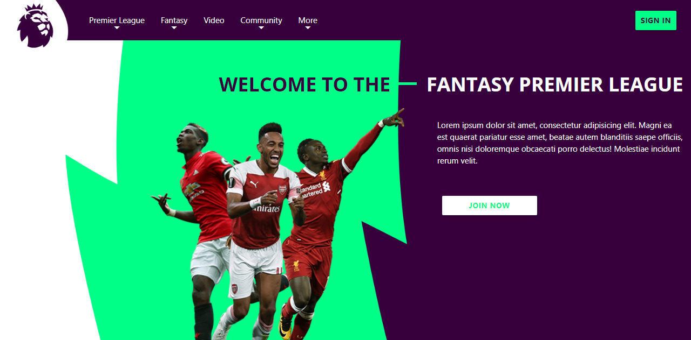

# Fantasy Premier League
This project serves a redesign of the [Fantasy Premier League](https://fantasy.premierleague.com) website. The project showcases different ideas of implementation of content from a UI and UX design perspective.

### Screenshots

### Getting Started
Clone or download the zip file of this project and open the index.html file to view the web page.

### Prerequisites
A web browser to view the web page (preferably Google Chrome)

## Built With
* [Materialize](https://materializecss.com)